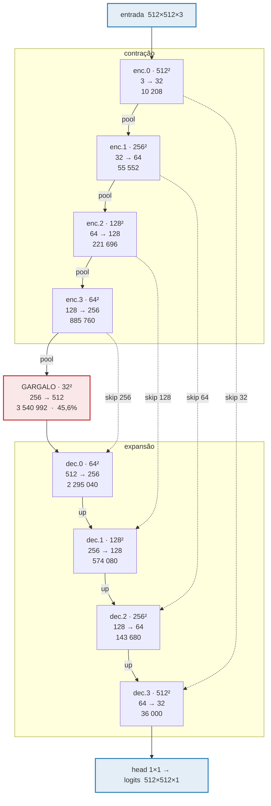

# Anatomia da U-Net

> `UNet(base=32, levels=4, in_ch=3)` — **7 763 041 parâmetros**, 48,28 GMAC por imagem de 512×512.
> Todos os números desta nota foram medidos no modelo em produção, não estimados.

Código: [[Módulos/identify.extract|identify.extract]] · Treino: [[Módulos/train_unet|train_unet]]

---

## O U

```
                              ENTRADA  512×512×3
                                   │
   res        ENCODER (contração)  │  DECODER (expansão)         res
 ════════════════════════════════════════════════════════════════════════
            ┌─────────────────┐         ┌─────────────────┐
 512×512    │     enc.0       │         │     dec.3       │      512×512
            │    3  →  32     │══ 32 ══▶│    64  →  32    │
            │    10 208 par   │  skip   │    36 000 par   │
            └────────┬────────┘         └────────▲────────┘
                     │ maxpool 2×                │ up.3  2×
            ┌────────▼────────┐         ┌────────┴────────┐
 256×256    │     enc.1       │══ 64 ══▶│     dec.2       │      256×256
            │   32  →  64     │  skip   │   128  →  64    │
            │    55 552 par   │         │   143 680 par   │
            └────────┬────────┘         └────────▲────────┘
                     │                           │ up.2  2×
            ┌────────▼────────┐         ┌────────┴────────┐
 128×128    │     enc.2       │═ 128 ══▶│     dec.1       │      128×128
            │   64  →  128    │  skip   │   256  →  128   │
            │   221 696 par   │         │   574 080 par   │
            └────────┬────────┘         └────────▲────────┘
                     │                           │ up.1  2×
            ┌────────▼────────┐         ┌────────┴────────┐
  64×64     │     enc.3       │═ 256 ══▶│     dec.0       │       64×64
            │  128  →  256    │  skip   │   512  →  256   │
            │   885 760 par   │         │  2 295 040 par  │
            └────────┬────────┘         └────────▲────────┘
                     │                           │ up.0  2×
                     │   ┌───────────────────┐   │
                     └──▶│     GARGALO       │───┘
  32×32                  │   256  →  512     │                    32×32
                         │  3 540 992 par    │
                         │      45,6 %       │
                         └───────────────────┘

                              head  1×1  32 → 1        ──▶  logits 512×512×1
                              33 parâmetros
```

**A leitura do U:** descendo, a resolução cai pela metade e os canais dobram — troca-se **onde** por **o quê**. Subindo, o inverso. As setas horizontais (`══▶`) são as conexões de salto, que devolvem ao decoder a informação de alta frequência que o encoder descartou no pooling.



---

## Os números, bloco a bloco

| bloco | resolução | canais | parâmetros | % dos par. | GMAC | % do custo |
|---|---:|---|---:|---:|---:|---:|
| `enc.0` | 512×512 | 3 → 32 | 10 208 | 0,1 % | 2,64 | 5,5 % |
| `enc.1` | 256×256 | 32 → 64 | 55 552 | 0,7 % | 3,62 | 7,5 % |
| `enc.2` | 128×128 | 64 → 128 | 221 696 | 2,9 % | 3,62 | 7,5 % |
| `enc.3` | 64×64 | 128 → 256 | 885 760 | 11,4 % | 3,62 | 7,5 % |
| **`bott`** | **32×32** | **256 → 512** | **3 540 992** | **45,6 %** | 3,62 | 7,5 % |
| `up.0`+`dec.0` | 64×64 | 512 → 256 | 2 295 040 | 29,6 % | 7,78 | 16,1 % |
| `up.1`+`dec.1` | 128×128 | 256 → 128 | 574 080 | 7,4 % | 7,78 | 16,1 % |
| `up.2`+`dec.2` | 256×256 | 128 → 64 | 143 680 | 1,9 % | 7,78 | 16,1 % |
| `up.3`+`dec.3` | 512×512 | 64 → 32 | 36 000 | 0,5 % | 7,78 | 16,1 % |
| `head` | 512×512 | 32 → 1 | 33 | ~0 % | 0,008 | ~0 % |
| **total** | | | **7 763 041** | | **48,28** | |

> [!important] Parâmetros e custo moram em lugares opostos
> O **gargalo** tem 45,6 % dos parâmetros e apenas **7,5 %** da computação — ele é largo em canais e minúsculo em área (32×32).
>
> Os quatro níveis do **decoder** somam 39,4 % dos parâmetros mas **64,4 %** da computação, porque cada um trabalha sobre uma área 4× maior que o de baixo.
>
> Isso tem consequência prática: passar de `base=24` para `base=32` custou +78 % de **memória de pesos**, mas o gargalo do tempo de inferência está no decoder, não onde os parâmetros foram acrescentados. É por isso que a latência precisa ser **remedida** e não extrapolada — dívida aberta, critério 3.11.

### Por que os canais dobram e a resolução cai pela metade

O produto `H · W · C` cai por 2 a cada nível: a área cai 4×, os canais sobem 2×. O tensor de ativação encolhe descendo o U, o que é o que torna o gargalo barato apesar de ter quase metade dos pesos.

Já os **parâmetros** de uma convolução são `C_out · C_in · 9`, sem H nem W. Dobrando ambos os canais, eles **quadruplicam** por nível. Daí a assimetria: os pesos concentram-se embaixo, o cálculo em cima.

---

## O bloco básico

Cada caixa do diagrama são duas convoluções 3×3, cada uma seguida de BatchNorm e ReLU:

```python
def _block(cin: int, cout: int) -> nn.Sequential:
    return nn.Sequential(
        nn.Conv2d(cin, cout, 3, padding=1, bias=False),
        nn.BatchNorm2d(cout), nn.ReLU(inplace=True),
        nn.Conv2d(cout, cout, 3, padding=1, bias=False),
        nn.BatchNorm2d(cout), nn.ReLU(inplace=True),
    )
```

**`bias=False` não é economia** — são 32 a 512 números por camada, irrelevante. É correção: o BatchNorm seguinte tem o seu próprio deslocamento (`bias`), então um bias na convolução seria redundante e imediatamente cancelado pela normalização.

Contas de um bloco, tomando `enc.1` (32 → 64):

| | |
|---|---|
| conv 1 | 64 × 32 × 3 × 3 = 18 432 |
| BN 1 | 64 × 2 = 128 |
| conv 2 | 64 × 64 × 3 × 3 = 36 864 |
| BN 2 | 64 × 2 = 128 |
| **total** | **55 552** ✓ |

Repare que a segunda convolução é sempre a cara — ela é `C_out × C_out`, enquanto a primeira é `C_out × C_in`.

### As pontes

```python
self.up.append(nn.ConvTranspose2d(chs[i + 1], chs[i], 2, stride=2))
```

`ConvTranspose2d` com kernel 2 e stride 2 dobra a resolução e **aprende** o upsampling, em vez de interpolar. Custa `C_in × C_out × 4` — 524 288 na maior (512 → 256).

E o decoder recebe o dobro de canais que devolve, porque o skip é **concatenado**:

```python
x = dec(torch.cat([up(x), s], dim=1))
#            256  +  256  =  512  →  256
```

É por isso que `dec.0` tem 512 → 256 e não 256 → 256.

---

## Contagem de parâmetros

```python
n_par = sum(p.numel() for p in model.parameters())    # train_unet.py:137
```

Isso **exclui** os buffers de BatchNorm, que não são treinados por gradiente. O arquivo do checkpoint carrega mais:

| | |
|---|---:|
| parâmetros (`.parameters()`) | 7 763 041 |
| escalares no `.pt` | 7 768 947 |
| diferença | **5 906** |

A diferença fecha exatamente: 18 camadas BN somando 2 944 canais → `running_mean` + `running_var` = 2 × 2 944 = 5 888, mais 18 `num_batches_tracked` = **5 906**.

### Escalonamento

| configuração | parâmetros |
|---|---:|
| `base=16, in_ch=1` | 1 942 289 |
| `base=24, in_ch=3` | 4 368 073 |
| **`base=32, in_ch=3`** | **7 763 041** |

7 763 041 / 1 942 289 = **3,996** — quadrático em `base`, porque todo peso de convolução carrega `C_out × C_in` e ambos escalam com ele.

O salto `in_ch` 1 → 3 custa **576 parâmetros** (só a primeira convolução): 32 × 3 × 9 = 864 contra 32 × 1 × 9 = 288. A [[Decisões de projeto#D2 · RGB em vez de luminância|mudança mais consequente do projeto]] é a mais barata em pesos.

---

## Campo receptivo

**173 × 173 px** — medido, não estimado.

Método: BatchNorm forçado a identidade, ReLU trocada por identidade, todos os pesos em valor absoluto (para nada cancelar), e depois o gradiente de **um** pixel de saída em relação à entrada. O suporte não-nulo é a união de todos os caminhos.

> [!caution] Isso corrige uma afirmação anterior
> A nota de arquitetura dizia "campo receptivo suficiente para ver a moldura inteira a 512 px". **Não é verdade.** 173 px é **33,8 %** do lado do quadrado do letterbox.
>
> Cada pixel da máscara é decidido olhando uma vizinhança de ~1/3 da figura, não a figura inteira. O que isso significa na prática: a rede consegue ver "há uma legenda perto daqui" e "esta linha atravessa toda a minha janela", mas **não** consegue ver a moldura inteira de uma vez para decidir se uma reta atravessa a figura de ponta a ponta.
>
> É consistente com o que os casos reais mostraram: o modelo erra justamente onde a decisão exige contexto global — uma reta de referência que coincide com o patamar por metade da largura.

---

## Onde a saída aparece

```python
self.head = nn.Conv2d(chs[0], 1, 1)     # 32 → 1, kernel 1×1
```

33 parâmetros — 32 pesos e 1 bias. A saída são **logits**, não probabilidades: a sigmoide fica na perda (`binary_cross_entropy_with_logits`, numericamente estável) e na inferência.

```python
p = torch.sigmoid(model(x))[0, 0].cpu().numpy()
m512 = np.where(p >= thr, 255, 0).astype(np.uint8)      # thr = 0.5
return unletterbox(m512, info)
```

---

Ver também: [[Módulos/identify.extract|identify.extract]] · [[Módulos/train_unet|train_unet]] · [[Critérios de qualidade]] · [[Decisões de projeto#D14 · Capacidade da rede: 32 canais base]]
